```shell
ssh bandit[0-9]@bandit.labs.overthewire.org -p 2220 > #Povezivanje sa hostom
```

## Level 0

```shell
ls -la > #Gledam fajlove,direktorije koje se nalaze u root direktoriju
cat readme > #Prikazujem sadrzaj readme fajla
```

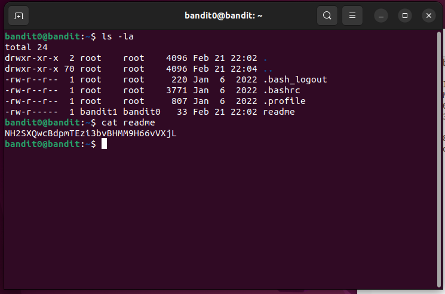

## Level 1

```shell
ls -la #Ponovo koristimo ls -la da prikazemo sve fajlove i datoteke
cat ./- #Posto je "-" standardni ulaz koristimo relativnu putanju
```

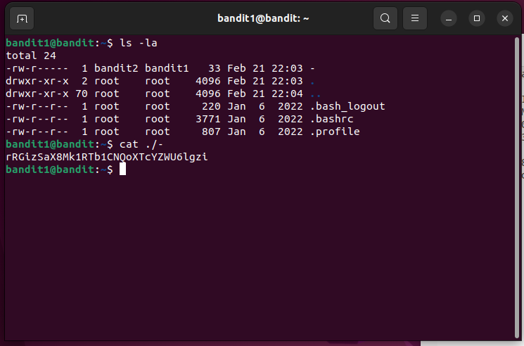

## Level 2

```shell
ls -la #Ponovo za istu stvar
cat spaces\ in \ this\ filename #Ispisujemo sadrzaj iz fajla
```

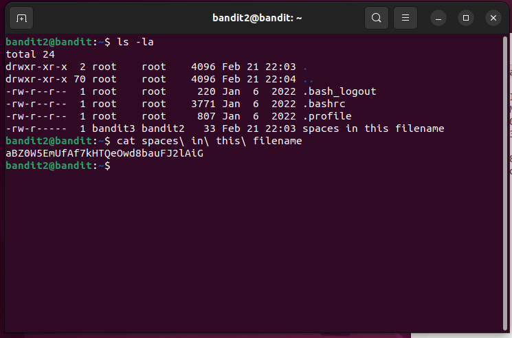

## Level 3

```shell
ls -la
ls -la #Prikazujem sve fajlove i one skrivene .hidden
cat .hidden #Da prikazem sadrzaj na ekranu
```

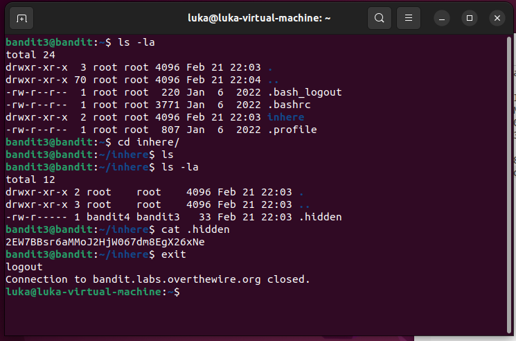

## Level 4

```shell
ls  -la
file./-* #Ovom komandom odredjujemo tip fajla tj trazimo fajl koji je "human-readable" koji pocinje sa "-"
```

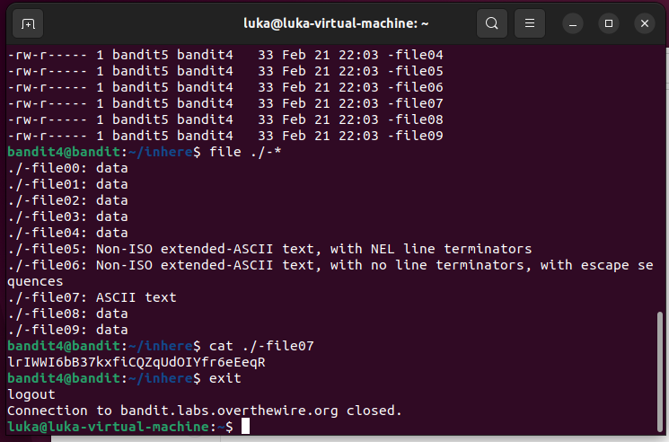

## Level 5

```shell
find . -type f -size 1033c #Trazimo fajl koji je velicine 1033 bajta
```

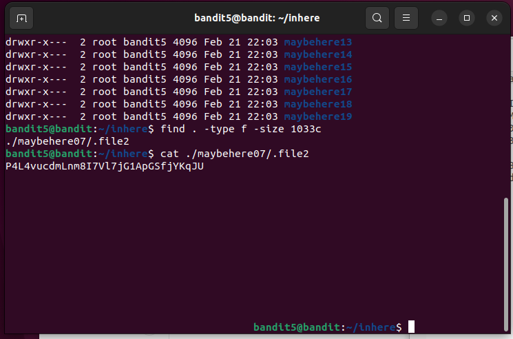

## Level 6

```shell
find / -type f -user bandit7 -group bandit6 -size 33c 2>/dev/null #Ovom komandom trazimo fajl koji pripada korisniku "bandit7" i grupi "bandit6" velicine 33 bajta 2>/dev/null sluzi da izbegnemo poruke o greskama prilikom pretrage direktorijuma
```
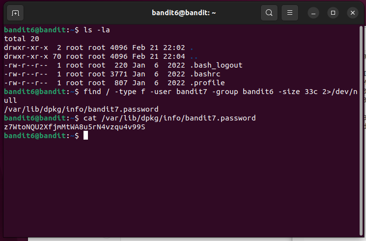

## Level 7

```shell
grep millionth data.txt #Trazimo liniju u fajlu data.txt koja sadrzi rec millionth
```

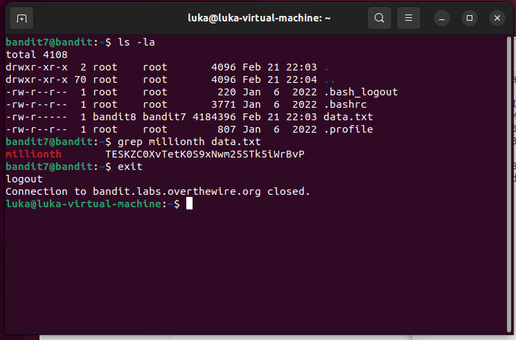

## Level 8

```shell
sort data.txt | uniq -u #Sortiramo fajl "data.txt" po abecednom redosledu reci. Komanda uniq se koristi za filtriranje ponavljajucih linija is sortirane liste, opcija -u sluzi da se prikaze samo linija koja se ne ponavljaju.
```
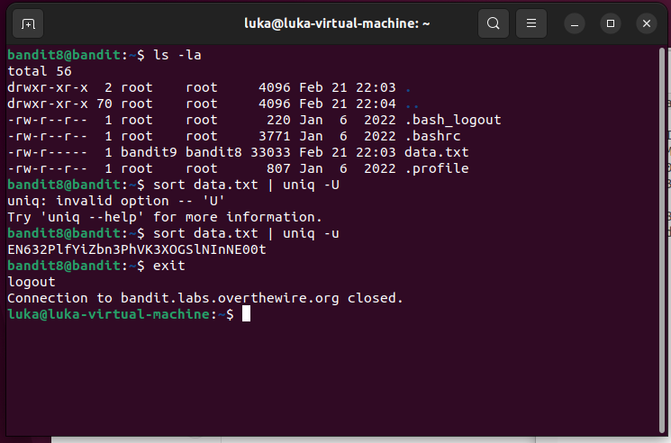

## Level 9
```shell
strings data.txt | grep "=" #Izdvaja sve nizove znakove iz datoteke a zatim se pretrazuje samo linije koje imaju znak "="
```
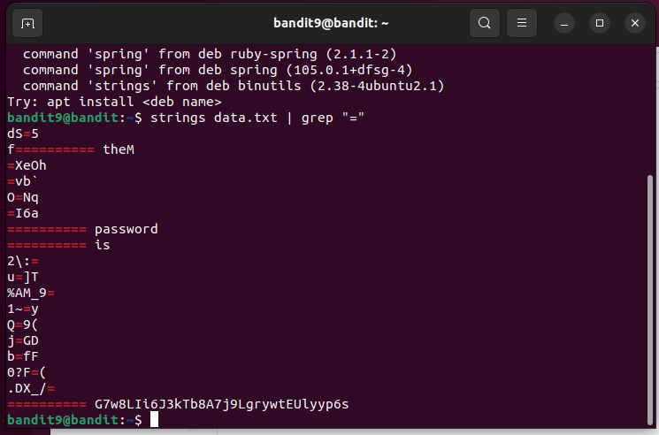

## Level 10 
```shell
base64 -d data.txt #Sluzi da dekodira sadrzaj fajla "data.txt" koji je u Base64 formatu.

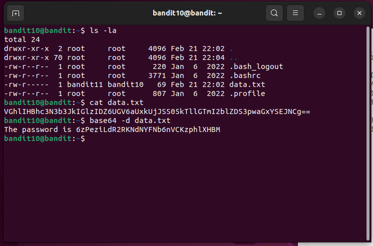