## Test 1

```shell
#!/bin/bash

factorial=1

for (( number = 1 ; number <= $1 ; number++ ))
do
	factorial=$[ $factorial * $number ]
done
echo The factorial of $1 is $factorial
```

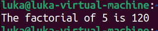

## Test 2

```shell
#!/bin/bash

total=$[ $1 * $2 ]
echo The first parametar is $1
echo The second parametar is $2
echo The total value is $total
```

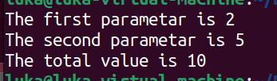

## Test 3

```shell
#!/bin/bash

echo Hello $1, glad to meet you.
```

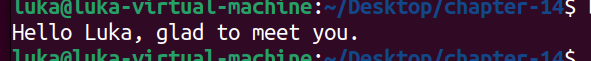

## Test 4

```shell
#!/bin/bash

total=$[ ${10} * ${11} ]
echo The tenth parameter is ${10}
echo The eleventh parameter is ${11}
echo The total is $total
```

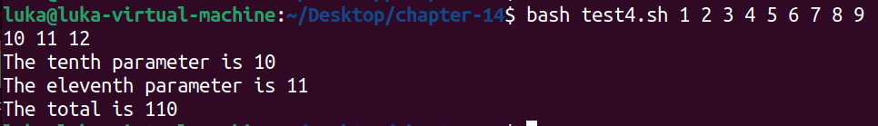

## Test 5

```shell
#!/bin/bash

echo The zero parameter is set to: $0
```

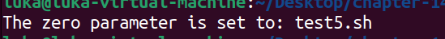

## Test 5b

```shell
#!/bin/bash

name=$(basename $0)
echo
echo The script name is: $name
```

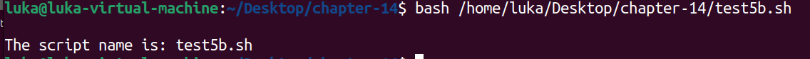

## Test 6

```shell
#!/bin/bash

name=$(basename $0)

if [ $name = "addem" ]
	then
		total=$[ $1 + $2 ]
	elif [ $name = "multem" ]
	then
		total=$[ $1 * $2 ]
fi

echo
echo The calculated value is $total
```

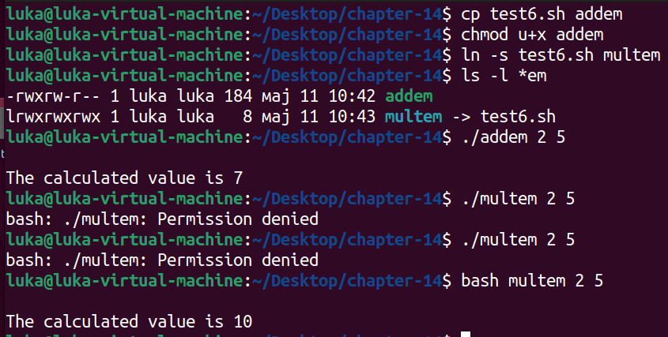

## Test 7

```shell
#!/bin/bash

if [ -n "$1" ]
then
	echo Hello $1, glad to meet you.
else
	echo "Sorry, you did not identify yourself."
fi
```

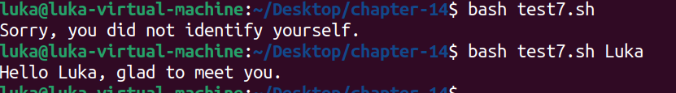

## Test 8

```shell
#!/bin/bash

echo There were $# parameters supplied.
```

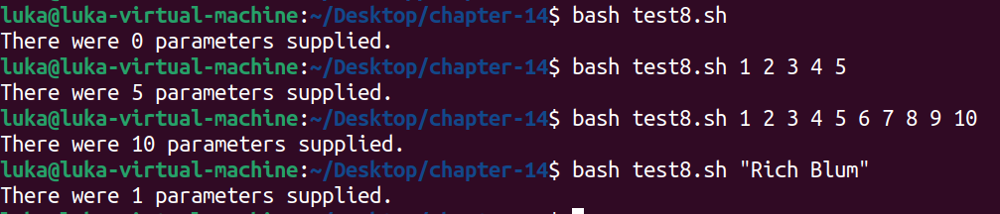

## Test 9

```shell
#!/bin/bash

if [ $# -ne 2 ]
then
	echo
	echo Usage: test9.sh a b
	echo
else
	total=$[ $1 + $2 ]
	echo 
	echo The total is $total
	echo
fi
```

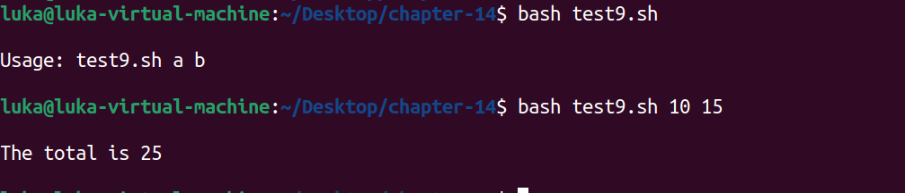

## Test 10

```shell
#!/bin/bash

params=$#
echo
echo The last parameter is $params
echo The last parameter is ${!#}
echo
```

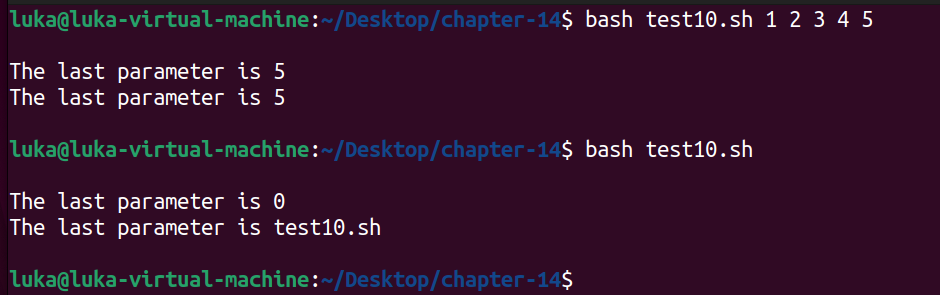

## Test 11

```shell
#!/bin/bash

echo
echo "Using the \$* method: $*"
echo
echo "Using the \$@ method: $@"
```

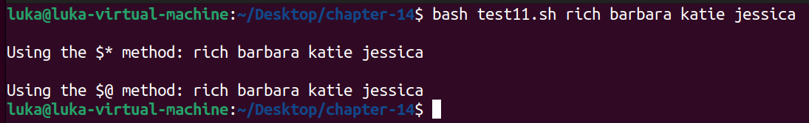

## Test 12

```shell
#!/bin/bash

echo
count=1

for param in "$*"
do
	echo "\$* Parameter #$count = $param"
	count=$[ $count + 1 ]
done

echo
count=1

for param in "$@"
do
	echo "\$@ Parameter #$count = $param"
	count=$[ $count + 1 ]
done
```
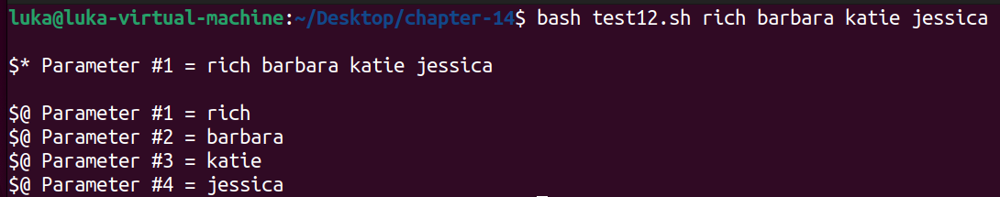

## Test 13

```shell
#!/bin/bash

echo
count=1
while [ -n "$1" ]
do
	echo "Parameter #$count = $1"
	count=$[ $count + 1 ]
	shift
done
```

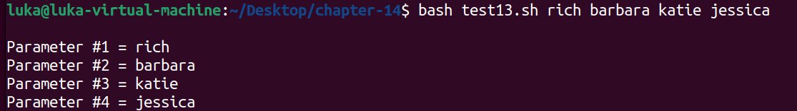

## Test 14

```shell
#!/bin/bash

echo
echo "The original parameters: $*"
shift 2
echo "Here's the new first parameter: $1"
```


## Test 15

```shell
#!/bin/bash

echo
while [ -n "$1" ]
do
	case "$1" in
		-a) echo "Found the -a option" ;;
		-b) echo "Found the -b option" ;;
		-c) echo "Found the -c option" ;;
		*) echo "$1 is not an option" ;;
	esac
	shift
done
```

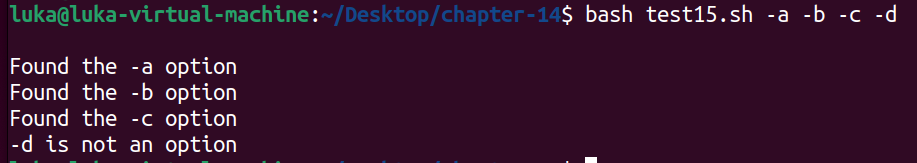

## Test 16

```shell
#!/bin/bash

echo
while [ -n "$1" ]
do
	case "$1" in
		-a) echo "Found the -a option" ;;
		-b) echo "Found the -b option" ;;
		-c) echo "Found the -c option" ;;
		--) shift
			break ;;
		*) echo "$1 is not an option" ;;
	esac
	shift
done

count=1
for param in $@
do
	echo "Parameter #$count: $param"
	count=$[ $count + 1 ]
done
```

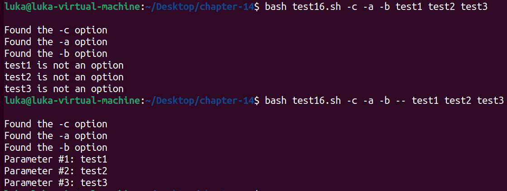

## Test 17

```shell
#!/bin/bash

echo
while [ -n "$1" ]
do
	case "$1" in
		-a) echo "Found the -a option" ;;
		-b) param="$2"
			echo "Found the -b option, with parameter value $param"
			shift ;;
		-c) echo "Found the -c option" ;;
		--) shift
			break ;;
		*) echo "$1 is not an option" ;;
	esac
	shift
done

count=1
for param in "$@"
do
	echo "Parameter #$count: $param"
	count=$[ $count + 1 ]
done
```

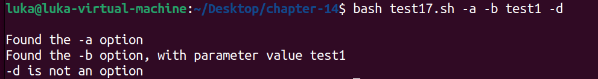

## Test 18

```shell
#!/bin/bash

set -- $(getopt -q ab:cd "$@")

echo
while [ -n "$1" ]
do
	case "$1" in
		-a) echo "Found the -a option" ;;
		-b) param="$2"
			echo "Found the -b option, with parameter value $param"
			shift ;;
		-c) echo "Found the -c option" ;;
		--) shift
			break ;;
		*) echo "$1 is not an option" ;;
	esac
	shift
done

count=1
for param in "$@"
do
	echo "Parameter #$count: $param"
	count=$[ $count + 1 ]
done
```

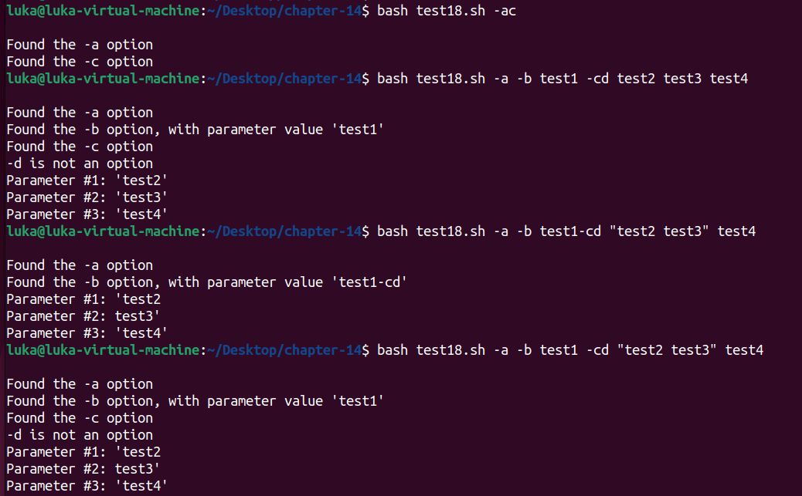

## Test 19

```shell
#!/bin/bash

echo
while getopts :ab:c opt
do
	case "$opt" in
		a) echo "Found the -a option" ;;
		b) echo "Found the -b option, with value $OPTARG" ;;
		c) echo "Found the -c option" ;;
		*) echo "Unknow option: $opt" ;;
	esac
done
```

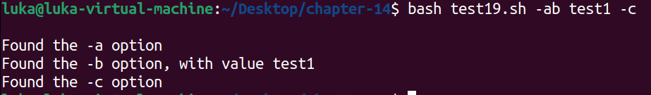

## Test 20

```shell
#!/bin/bash

echo
while getopts :ab:cd opt
do
	case "$opt" in
		a) echo "Found the -a option" ;;
		b) echo "Found the -b option, with value $OPTARG" ;;
		c) echo "Found the -c option" ;;
		d) echo "Found the -d option" ;;
		*) echo "Unknown option: $opt" ;;
	esac
done

shift $[ $OPTIND - 1 ]

echo
count=1
for param in "$@"
do
	echo "Parameter $count: $param"
	count=$[ $count + 1 ]
done
```

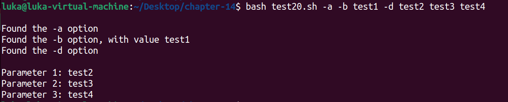

## Test 21 

```shell
#!/bin/bash

echo -n "Enter your name: "
read name
echo "Hello $name, welcome to my program."
```


## Test 22

```shell
#!/bin/bash

read -p "Please enter your age: " age
days=$[ $age * 365 ]
echo "That makes you over $days days old!"
```


## Test 23

```shell
#!/bin/bash

read -p "Enter your name: " first last
echo "Checking data for $last, $first..."
```


## Test 24

```shell
#!/bin/bash

read -p "Enter your name: "
echo
echo Hello $REPLY, welcome to my program.
```


## Test 25

```shell
#!/bin/bash

if read -t 5 -p "Please enter your name: " name
then
	echo "Hello $name, welcome to my script"
else
	echo
	echo "Sorry, to slow! "
fi
```


## Test 26

```shell
#!/bin/bash

read -n1 -p "Do you want to continue [Y/N]? " answer
case $answer in
	Y | y) echo
		echo "fine, countinue on..." ;;
	N | n) echo
		echo OK, goodbye
		exit;;
esac
echo "This is the end of the script"
```


## Test 27

```shell
#!/bin/bash

read -s -p "Enter your password: " pass
echo
echo "Is your password really $pass?"
```


## Test 28

```shell
#!/bin/bash

count=1
cat test | while read line
do
	echo "Line $count: $line"
	count=$[ $count + 1 ]
done
echo "Finished processing the file"
```

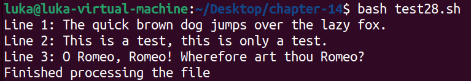
