## Test 8

```shell
#!/bin/bash

echo "This is an error" >&2
echo "This is normal output"
```

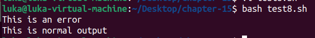

## Test 9

```shell
This is an error
```

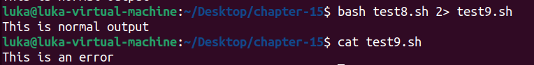

## Test 10

```shell
#!/bin/bash

exec 1>testout

echo "This is a test of redirecting all output"
echo "from a script to another file."
echo "Without having to redirect every individual line"
```

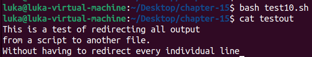

## Test 11

```shell
#!/bin/bash

exec 2>testerror

echo "This is the start of the script"
echo "now redirecting all output to another location"

exec 1>testout

echo "This output should go to the testout file"

echo "but this should go to the testerror file" >&2
```

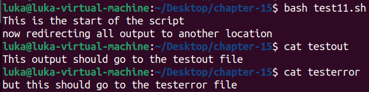

## Test 12

```shell
#!/bin/bash

exec 0< testfile
count=1

while read line
do
	echo "Line #$count: $line"
	count=$[ $count + 1 ]
done
```

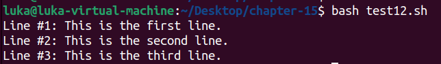

## Test 13

```shell
#!/bin/bash

exec 3>test13out

echo "This should display on the monitor"
echo "and this should be stored in the file" >&3
echo "Then this should be back on the monitor"
```

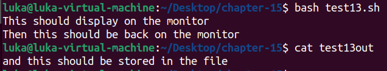

## Test 14

```shell
#!/bin/bash


exec 3>&1
exec 1>test14out

echo "This should store in the output file"
echo "along with this line."

exec 1>&3

echo "Now things should be back to normal"
```

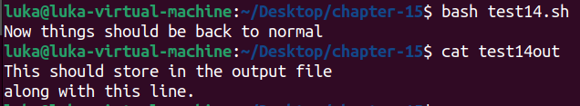

## Test 15

```shell
#!/bin/bash

exec 6<&0

exec 0< testfile

count=1
while read line
do
	echo "Line #$count: $line"
	count=$[ $count + 1 ]
done
exec 0<&6
read -p "Are you done now?" answer
case $answer in
	Y | y) echo "Goodbye" ;;
	N | n) echo "Sorry, this is the end." ;;
esac
```

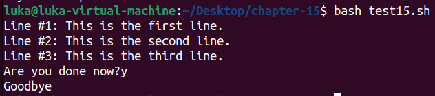

## Test 16

```shell
#!/bin/bash

exec 3<> testfile
read line <&3
echo "Read: $line"
echo "This is a test line" >&3
```

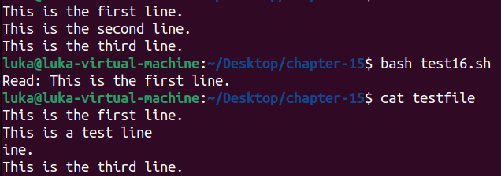

## Test 17

```shell
#!/bin/bash

exec 3> test17file
echo "This is a test line of data" >&3
exec 3>&-
```


## Test 18

```shell
#!/bin/bash

exec 3> test18file1
exec 6> test18file2
exec 7< testfile

/usr/sbin/lsof -a -p $$ -d0,1,2,3,6,7
```


## Test 19

```shell
#!/bin/bash

tempfile=$(mktemp test19.XXXXXX)

exec 3>$tempfile

echo "This script writes to temp file $tempfile"

echo "This is the first line" >&3
echo "This is the second line." >&3
echo "This is the last line." >&3
exec 3>&-

echo "Done creating temp file. The contents are:"
cat $tempfile
rm -f $tempfile 2> /dev/null
```

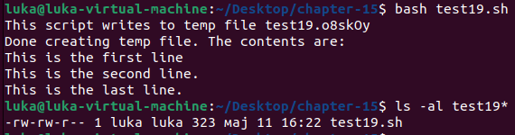

## Test 20

```shell
#!/bin/bash

tempfile=$(mktemp -t tmp.XXXXXX)

echo "This is a test file." > $tempfile
echo "This is the second line of the test." >> $tempfile

echo "The temp file is located at: $tempfile"
cat $tempfile
rm -f $tempfile
```

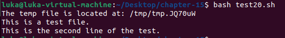

## Test 21

```shell
#!/bin/bash

tempdir=$(mktemp -d dir.XXXXXX)
cd $tempdir
tempfile1=$(mktemp temp.XXXXXX)
tempfile2=$(mktemp temp.XXXXXX)
exec 7> $tempfile1
exec 8> $tempfile2

echo "Sending data to directory $tempdir"
echo "This is a test line of data for $tempfile1" >&7
echo "This is a test line of data for $tempfile2" >&8
```

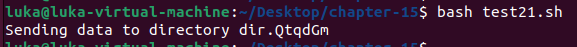

## Test 22

```shell
#!/bin/bash

tempfile=test22file

echo "This is the start of the test" | tee $tempfile
echo "This is the second line of the test" | tee -a $tempfile
echo "This is the end of the test" | tee -a $tempfile
```

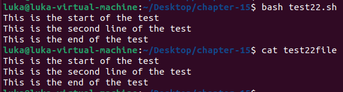

## Test 23

```shell
#!/bin/bash

outfile='members.sql'
IFS=','
while read lname fname address city state zip
do
	cat >> $outfile << EOF
	INSERT INTO members (lname,fname,address,city,state,zip) VALUES
('$lname', '$fname', '$address', '$city', '$state', '$zip');
EOF
done < ${1}
```


