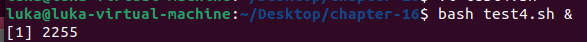
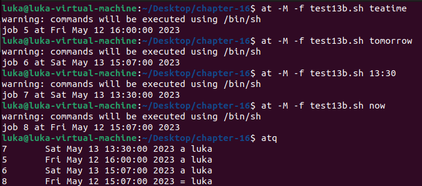

## Test 1

```shell
#!/bin/bash

trap "echo ' Sorry! I have trapped Ctrl-C'" SIGINT

echo This is a test script

count=1
while [ $count -le 10 ]
do
	echo "Loop #$count"
	sleep 1
	count=$[ $count + 1 ]
done

echo "This is the end of the test script"
```


## Test 2

```shell
#!/bin/bash

trap "echo Goodbye..." EXIT

count=1
while [ $count -le 5 ]
do
	echo "Loop #$count"
	sleep 1
	count=$[ $count + 1 ]
done
```


## Test 3

```shell
#!/bin/bash

trap "echo ' Sorry... Ctrl-C is trapped.'" SIGINT

count=1
while [ $count -le 5 ]
do
	echo "Loop #$count"
	sleep 1
	count=$[ $count + 1 ]
done

trap "echo ' I modified the trap
```


## Test 3b

```shell
#!/bin/bash

trap "echo ' Sorry... Ctrl-C is trapped. ' " SIGINT

count=1

while [ $count -le 10 ]
do
	echo "Loop #$count"
	sleep 1
	count=$[ $count + 1 ]
done


trap -- SIGINT
echo "I just removed the trap"

count=1

while [ $count -le 5 ]
do
	echo "Second Loop #$count"
	sleep 1
	count=$[ $count + 1 ]
done
```


## Test 4 

```shell
#!/bin/bash

count=1

while [ $count -le 10 ]
do
	sleep 1
	count=$[ $count + 1 ]
done
```



## Test 5

```shell
#!/bin/bash

echo "Start the test script"

count=1

while [ $count -le 5 ]
do
	echo "Loop #$count"
	sleep 5
	count=$[ $count + 1 ]
done

echo "Test script is complete"
```


## Test 10

```shell
#!/bin/bash

echo "Script Process ID: $$"

count=1

while [ $count -le 10 ]
do
	echo "Loop #$count"
	sleep 10
	count=$[ $count + 1 ]
done

echo "End of script..."
```


## Test 13

```shell
#!/bin/bash


echo "This script ran at $(data + %B%d,%T)"
echo
sleep 5
echo "This is the script's end..."
```


## Test 13b

```shell
#!/bin/bash

echo "This script ran at $(date + %B%d,%T)" > test13b.out
echo >> test13b.out
sleep 5
echo "This is the script's end..." >> test13b.out
```

